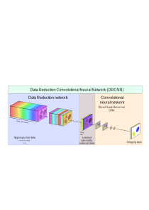

# <a href="https://www.mdpi.com/2313-433X/6/12/132" style="color: black;">DRNN</a>: Hyperspectral data reduction in supervised deep learning

   <p align="center">
   
    </p>
    
## Introduction

DRCNN (Data Reduction Convolutional Network) is a deep learning architecture for tasks on hyperspectral images. The network is designed to compress the hyperspectral images in a data reduction layer after which a conventional CNN carries out the image task. By connecting both components and applying end-to-end training, optimal data compression can be learned for a given imaging task (e.g. segmentation or classification).

This package provides scripts for applying DRCNN with simulated hyperspectral X-ray images and hyperspectral remote sensing based images. Both modailities can be tested on provided scripts for DRU-Net and DRMSD. In addition, the package provides scripts for complete reproduction of the experiments in the associated paper titled '[Task-Driven Learned Hyperspectral Data Reduction Using End-to-End Supervised Deep Learning](https://www.mdpi.com/2313-433X/6/12/132)', in which the data recution method is demonstrated and analyzed on numerical hyperspectral X-ray and remote sensing data with DRU-Net and DRMSD.

## Requirements

## Scripts

## Example results

## References

The algorithms and routines implemented in this Python package are described in following [paper](https://www.mdpi.com/2313-433X/6/12/132) published in Journal of Imaging. If you use (parts of) this code in a publication, we would appreciate it if you would refer to:

```
@article{
  title={Task-driven learned hyperspectral data reduction using end-to-end supervised deep learning},
  author={Zeegers, Math{\'e} T and Pelt, Dani{\"e}l M and van Leeuwen, Tristan and van Liere, Robert and Batenburg, Kees Joost},
  journal={Journal of Imaging},
  volume={6},
  number={12},
  pages={132},
  year={2020},
  publisher={MDPI}
}
```

## Authors

Code written by:
- Mathé Zeegers (m [dot] t [dot] zeegers [at] cwi [dot] nl).

DRMSD code written by Daniël Pelt. 

The MSD and UNet training scripts contain elements of MSD code (https://github.com/dmpelt/msdnet) by Daniël Pelt and PyTorch UNet code (https://github.com/usuyama/pytorch-unet) by Naoto Usuyama respectively.
