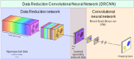

# <a href="https://www.mdpi.com/2313-433X/6/12/132" style="color: black;">DRCNN</a>: Hyperspectral data reduction in supervised deep learning

   <p align="center">
   
    </p>
    
## Introduction

DRCNN (Data Reduction Convolutional Network) is a deep learning architecture for tasks on hyperspectral images. The network is designed to compress the hyperspectral images in a data reduction layer after which a conventional CNN carries out the image task. By connecting both components and applying end-to-end training, optimal data compression can be learned for a given imaging task (e.g. segmentation or classification).

This package provides scripts for applying DRCNN with simulated hyperspectral X-ray images and hyperspectral remote sensing based images. Both modailities can be tested on provided scripts for DRU-Net and DRMSD. In addition, the package provides scripts for complete reproduction of the experiments in the associated paper titled '[Task-Driven Learned Hyperspectral Data Reduction Using End-to-End Supervised Deep Learning](https://www.mdpi.com/2313-433X/6/12/132)', in which the data reduction method is demonstrated and analyzed on numerical hyperspectral X-ray and remote sensing data with DRU-Net and DRMSD.

## Requirements

## Scripts

The package contains code to generate X-ray and remote sensing based images, as well as to apply PCA, NMF and LDA reductions on the generated data for comparison with the DRCNN method. Furthermore, (DR)MSD and (DR)U-Net scripts are provided to train on each configuration (the X-ray segmetentation problem has a few- and many-material setting, while the remote sensing problem has a non-overlapping and partially overlapping setting). For the resulting trained networks, testing and plotting scripts are provided to replicate the results in the [paper](https://www.mdpi.com/2313-433X/6/12/132). The scripts folder is organized in the following manner:

```
├── scripts
    ├── RemoteSensing
    │   ├── generation
    │   │   ├────────────── EnvironmentsGenerator.py
    │   │   ├────────────── EnvironmentsGeneratorPartiallyOverlapping.py
    │   │   ├────────────── SpectralRemoteSensingDataGenerator.py
    │   │   ├────────────── ApplyNoise.py
    │   │   ├────────────── PCAFromDataset.py
    │   │   ├────────────── NMFFromDataset.py
    │   │   └────────────── LDAFromDataset.py
    │   ├── training
    │   │   ├── MSD
    │   │   │   ├── PartiallyOverlappingFalse
    │   │   │   │   └────── RemoteSensingDRMSDPartiallyOverlappingFalse_train_segm.py
    │   │   │   └── PartiallyOverlappingTrue
    │   │   │       ├────── RemoteSensingDRMSDPartiallyOverlappingTrue_train_segm.py
    │   │   │       └── RobustnessExperiment
    │   │   │           └── RemoteSensingDRMSDPartiallyOverlappingTrue_train_segmRobustnessExp.py
    │   │   └── UNet
    │   │       ├── PartiallyOverlappingFalse
    │   │       │   └────── RemoteSensingDRMSDPartiallyOverlappingFalse_train_segm.py
    │   │       └── PartiallyOverlappingTrue
    │   │           ├────── RemoteSensingDRMSDPartiallyOverlappingTrue_train_segm.py
    │   │           └── RobustnessExperiment
    │   │               └── RemoteSensingDRMSDPartiallyOverlappingTrue_train_segmRobustnessExp.py
    │   ├── testing
    │   │   ├────────────── RemoteSensingDRMSDReductionsTest.py
    │   │   ├────────────── RemoteSensingDRMSDComputeWeights.py
    │   │   ├────────────── RemoteSensingDRUNetReductionsTest.py
    │   │   └────────────── RemoteSensingDRUNetComputeWeights.py
    │   └── plotting
    │       ├────────────── PlotRemoteSensingDRMSDReductionChannelsResults.py
    │       └────────────── PlotRemoteSensingDRUNetReductionChannelsResults.py
    ├── RemoteSensing
    │   ├── generation
    │   │   ├────────────── MaterialProjectionsGenerator.py
    │   │   ├────────────── SpectralDataGenerator.py
    │   │   ├────────────── PCAFromDataset.py
    │   │   ├────────────── NMFFromDataset.py
    │   │   └────────────── LDAFromDataset.py
    │   ├── training
    │   │   ├── MSD
    │   │   │   ├── ManyMaterialsFalse
    │   │   │   │   └────── X-rayDRMSDManyMaterialsFalse_train_segm.py
    │   │   │   └── ManyMaterialsTrue
    │   │   │       ├────── X-rayDRMSDManyMaterialsTrue_train_segm.py
    │   │   │       └── RobustnessExperiment
    │   │   │           └── X-rayDRMSDManyMaterialsTrue_train_segmRobustnessExp.py
    │   │   └── UNet
    │   │       ├── ManyMaterialsFalse
    │   │       │   └────── X-rayDRUNetManyMaterialsFalse_train.py
    │   │       └── ManyMaterialsTrue
    │   │           ├────── X-rayDRUNetManyMaterialsTrue_train.py
    │   │           └── RobustnessExperiment
    │   │               └── X-rayDRUNetManyMaterialsTrue_trainRobustnessExp.py
    │   ├── testing
    │   │   ├────────────── X-rayDRMSDReductionsTest.py
    │   │   ├────────────── X-rayDRMSDComputeWeights.py
    │   │   ├────────────── X-rayDRUNetReductionsTest.py
    │   │   └────────────── X-rayDRUNetComputeWeights.py
    │   └── plotting
    │       ├────────────── PlotX-rayDRMSDReductionChannelsResults.py
    │       └────────────── PlotX-rayDRUNetReductionChannelsResults.py
    └── RobustnessTests
        ├────────────────── RobustnessTestMSD.py
        └────────────────── RobustnessTestUNet.py
```    

For the training of the networks there are scripting files available that allows for scheduling the training procedures on the GPU (named ScripterCUDA*coreindex*). To replicate the results in the paper, change the training times in these scripts accordingly.

To reproduce the various results in the [paper](https://www.mdpi.com/2313-433X/6/12/132), follow the following scripts:
- **Section 4.4.1:** Run all data generation scripts for X-ray and remote sensing, then run all the training scripts, run the ReductionsTest.py scripts and finally the scripts in the plotting folders. 
- **Section 4.4.2**: Run all data generation scripts for X-ray and remote sensing, then run all the training scripts (in the ManyMaterialsTrue folder for X-ray and the PartiallyOverlapping folder for remote sentings), run the ReductionsTest.py scripts in the testing folders and finally the scripts in the plotting folders.
- **Section 4.4.3**: Run all data generation scripts for X-ray and remote sensing, then run all the training scripts, and then the ComputeWeights testing scripts.
- **Appendix B**: Run all data generation scripts for X-ray and remote sensing, then run the training scripts in the RobustnessExperiments/ folders, and then scripts in the RobustnessTests.py to generate the resuls.

The resulting plots (see examples below) will be located /results folder.

## Example results

   <p align="center">
   
   
   
   </p>
   <p align="center">
   
   
   
   </p>

## References

The algorithms and routines implemented in this Python package are described in following [paper](https://www.mdpi.com/2313-433X/6/12/132) published in Journal of Imaging. If you use (parts of) this code in a publication, we would appreciate it if you would refer to:

```
@article{
  title={Task-driven learned hyperspectral data reduction using end-to-end supervised deep learning},
  author={Zeegers, Math{\'e} T and Pelt, Dani{\"e}l M and van Leeuwen, Tristan and van Liere, Robert and Batenburg, Kees Joost},
  journal={Journal of Imaging},
  volume={6},
  number={12},
  pages={132},
  year={2020},
  publisher={MDPI}
}
```

## Authors

Code written by:
- Mathé Zeegers (m [dot] t [dot] zeegers [at] cwi [dot] nl).

DRMSD code written by Daniël Pelt. 

The MSD and UNet training scripts contain elements of MSD code (https://github.com/dmpelt/msdnet) by Daniël Pelt and PyTorch UNet code (https://github.com/usuyama/pytorch-unet) by Naoto Usuyama respectively.
